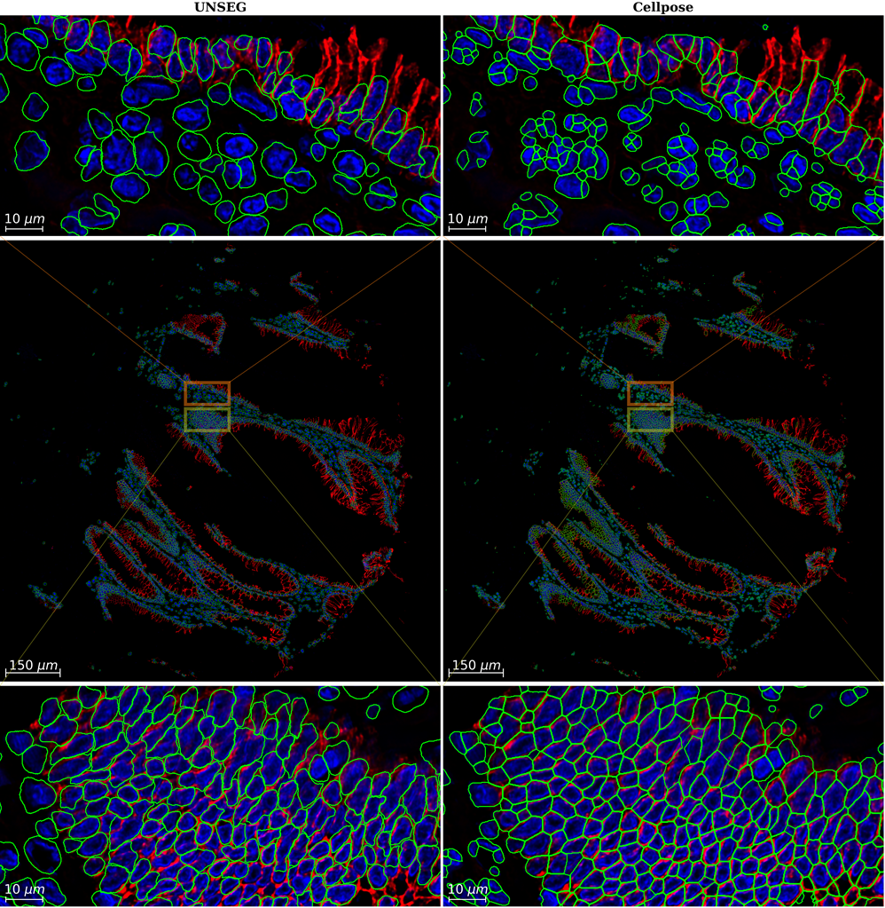

# UNSEG for Unsupervised Segmentation of Cells and Their Nuclei in Tissue Images

This is an implementation of [UNSEG](https://www.biorxiv.org/content/10.1101/2023.11.13.566842v2) on Python 3 with using  scikit-image, OpenCV, scikit-learn, and SciPy. The algorithm generates two mutually-consistent segmentation masks for cells and their nuclei in images of complex tissue samples. 


The repository includes:
* Source Python code of UNSEG (unseg.py).
* Jupyter notebook to demonstrate the nuclei and cell segmentation pipeline (run_unseg.ipynb).
* Zipped test RGB image of human gallbladder tissue, where the blue and red channels contain nucleus and cell membrane markers, respectively. Please extract "image.zip" before running the notebook.
* Requirements.txt

## Installation
UNSEG uses the following Python libraries:
```
opencv-python==4.7.0.72
numpy==1.24.3
matplotlib==3.7.1
scikit-image==0.20.0
scikit-learn==1.2.2
scipy==1.9.1
```
Before running UNSEG, make sure you have these or newer versions of these libraries installed.

## Usage
It is recommended to start using UNSEG by running a segmentation example in the Jupyter notebook (run_unseg.ipynb).
Before running the Jupyter notebook, make sure that you place the Jupyter notebook and the unseg.py file in the same directory.

To segment both nuclei and cells, import `nuclei_cell_segmentation` using
```
from unseg import nuclei_cell_segmentation
```

To segment only nuclei, import `nuclei_segmentation` using
```
from unseg import nuclei_segmentation
```

### Format of input image and parameters of `nuclei_cell_segmentation`
The primary UNSEG parameters are `area_threshold` and `convexity_threshold`. If the UNSEG segmentation needs to be optimized for an individual image or a set of images then these parameters should be adjusted. The remaining parameters, if needed, can also be used to fine-tune performance. The default values of UNSEG parameters and reasonable ranges for their adjustment are shown in [Supplementary Table 2](https://www.biorxiv.org/content/10.1101/2023.11.13.566842v2.supplementary-material)
* `intensity` : 3D (height, width, channels) numpy array.
        Intensities of nuclei marker (channel index = 0) and cell membrane marker (channel index = 1).
* `area_threshold` : int (positive).
        The minimal possible area of a nucleus in pixels.
* `convexity_threshold` : int (positive)
        The largest allowable deviation (in pixels) of a boundary point from its convex hull for a convex component.
* `cell_marker_threshold` : int (positive).
        Defines whether a cell membrane marker is present in a cluster of nuclei.
* `dist_tr` : string, one of "DT" or "GDT".
        Defines geometrical distance transform (DT) or gradient distance transform (GDT) in the Virtual Cuts.
* `sigma0` : float (positive).
        The standard deviation of the Gaussian filter.
* `k0` : float (positive).
        The degree of smoothing of the Gradient Adaptive Filter.
* `r0` : int (positive).
        The disk kernel radius of the local Otsu method.
* `pct` : list of two positive floats, [float (positive), float (positive)].
        The background a priori probability thresholds for every of two channels.
* `nk` : list of positive integers, [int (positive), int (positive), ...].
        The list of kernel sizes in the Local Mean Suppression Filter.
* `t0` : float (positive).
        The intensity threshold in the Local Mean Suppression Filter.
* `ternary_met` : string, one of "Argmax" or "Kmeans".
        Defines the algorithm to compute a posteriori local and global masks.
* `visualization` : bool.
        Plots a priori probabilities, a posteriori local and global masks, contrast based likelihood function, and nuclei and cell segmentations.
* `area_ratio_threshold` : float (positive).
        The area threshold for a cell without a nucleus.
* `dilation_radius` : int (positive).
        The nucleus mask is morphologically dilated by this amount for cells without cell membrane marker expression.

### Outputs of `nuclei_cell_segmentation`
* `nuc_seg` : 2D (height, width) numpy 'int32' array.
        Mask of segmented nuclei.
* `cel_seg` : 2D (height, width) numpy 'int32' array.
        Mask of segmented cells.
* `n_nuclei` : int.
        Number of segmented nuclei.
* `n_cells` : int.
        Number of segmented cells.

## Rare Memory Error and Its Troubleshooting
Sometimes the segmentation of fluorescence images with very noisy nucleus marker (image channel 0) or/and missing cell membrane marker (image channel 1) leads to the formation of enormous ammount of nucleus clusters having self-intersections. During the Pertubated Watershed processing stage, the user may see multiple WARNINGS and a sharp increase in RAM usage that eventially can lead to the Memory Error. To avoid the formation of numerous spurious clusters and, as a result, the memory error, we recommend to denoise the image background. For example, one can use the function `denoise_nucleus_background` for image pre-processing before its segmentation with UNSEG.
```
import numpy as np
from skimage.filters import gaussian, threshold_multiotsu

def scale_img(img):
    img = img.astype('float64')
    i_min = np.min(img)
    i_max = np.max(img)
    if i_max-i_min > 0:
        img = (img-i_min)/(i_max-i_min)
    return img

def denoise_nucleus_background(intensity):
    intensity = intensity.astype('float64')
    n = intensity.shape[2]
    for i in range(n):
        intensity[:,:,i] = scale_img(intensity[:,:,i])
        if i == 0:
            mask = gaussian(intensity[:,:,i], sigma=3)
            mask = scale_img(mask)
	    thr = threshold_multiotsu(mask, classes=3)
	    mask = mask < thr[0]
	    intensity[mask,i] = 0
    return intensity

intensity = denoise_nucleus_background(intensity)
```

## Citing UNSEG

If you find UNSEG useful in your research, please consider citing:
```
Kochetov B, Bell P, Garcia PS, Shalaby AS, Raphael R, Raymond B, Leibowitz BJ, Schoedel K, Brand RM, Brand RE, Yu J, Zhang L, Diergaarde B, Schoen RE, Singhi A, and Uttam S. UNSEG: unsupervised segmentation of cells and their nuclei in complex tissue samples. Commun Biol 7, 1062 (2024). https://doi.org/10.1038/s42003-024-06714-4.
```
```
@article {KU2024,
	author = {Kochetov, Bogdan and Bell, Phoenix and Garcia, Paulo S. and Shalaby, Akram S. and Raphael, Rebecca and Raymond, Benjamin and Leibowitz, Brian J. and Schoedel, Karen and Brand, Rhonda M. and Brand, Randall E. and Yu, Jian and Zhang, Lin and Diergaarde, Brenda and Schoen, Robert E. and Singhi, Aatur and Uttam, Shikhar},
	title = {UNSEG: unsupervised segmentation of cells and their nuclei in complex tissue samples},
	year = {2024},
	doi = {10.1038/s42003-024-06714-4},
	publisher = {Springer Nature},
	volume = {7},
	number = {1062},
	abstract = {Multiplexed imaging technologies have made it possible to interrogate complex tissue microenvironments at sub-cellular resolution within their native spatial context. However, proper quantification of this complexity requires the ability to easily and accurately segment cells into their sub-cellular compartments. Within the supervised learning paradigm, deep learning-based segmentation methods demonstrating human level performance have emerged. However, limited work has been done in developing such generalist methods within the unsupervised context. Here we present an easy-to-use unsupervised segmentation (UNSEG) method that achieves deep learning level performance without requiring any training data via leveraging a Bayesian-like framework, and nucleus and cell membrane markers. We show that UNSEG is internally consistent and better at generalizing to the complexity of tissue morphology than current deep learning methods, allowing it to unambiguously identify the cytoplasmic compartment of a cell, and localize molecules to their correct sub-cellular compartment. We also introduce a perturbed watershed algorithm for stably and automatically segmenting a cluster of cell nuclei into individual nuclei that increases the accuracy of classical watershed. Finally, we demonstrate the efficacy of UNSEG on a high-quality annotated gastrointestinal tissue dataset we have generated, on publicly available datasets, and in a range of practical scenarios..},
	URL = {https://doi.org/10.1038/s42003-024-06714-4},
	journal = {Communications Biology}
}
```
## Exemplar
Tissue microenvironments are difficult to segment due to the complexity and heterogeneity of the tissue architecture and cellular morphology. Below is an example where we perform UNSEG and Cellpose on a tissue sample that capture this challenge. The example demonstrates the quality of UNSEG's performance.

