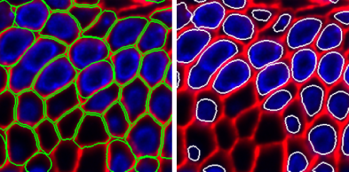

# UNSEG for Unsupervised Segmentation of Cells and Their Nuclei in Tissue Images

This is an implementation of [UNSEG](https://www.biorxiv.org/) on Python 3 with using  scikit-image, OpenCV, scikit-learn, and SciPy. The algorithm generates two mutually-consistent segmentation masks for cells and their nuclei in images of complex tissue samples. 

The repository includes:
* Source Python code of UNSEG.
* Jupyter notebook to demonstrate the nuclei and cell segmention pipeline.
* Zipped test RGB image of human gallbladder tissue, where the blue and red channels contain nucleus and cell membrane markers, respectively.  
