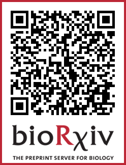

# UNSEG for Unsupervised Segmentation of Cells and Their Nuclei in Tissue Images

This is an implementation of [UNSEG](https://www.biorxiv.org/content/10.1101/2023.11.13.566842v1) on Python 3 with using  scikit-image, OpenCV, scikit-learn, and SciPy. The algorithm generates two mutually-consistent segmentation masks for cells and their nuclei in images of complex tissue samples. 


The repository includes:
* Source Python code of UNSEG.
* Jupyter notebook to demonstrate the nuclei and cell segmention pipeline.
* Zipped test RGB image of human gallbladder tissue, where the blue and red channels contain nucleus and cell membrane markers, respectively.
* Requirements.txt

* If you find UNSEG useful in your research, please consider citing:
```
@article {Kochetov2023.11.13.566842,
	author = {Bogdan Kochetov and Phoenix Bell and Paulo S Garcia and Akram S Shalaby and Rebecca Raphael and Benjamin Raymond and Brian J Leibowitz and Karen
Schoedel and Rhonda M Brand and Randall E Brand and Jian Yu and Lin Zhang and Brenda Diergaarde and Robert E Schoen and Aatur Singhi and Shikhar Uttam},
	title = {UNSEG: unsupervised segmentation of cells and their nuclei in complex tissue samples},
	elocation-id = {2023.11.13.566842},
	year = {2023},
	doi = {10.1101/2023.11.13.566842},
	publisher = {Cold Spring Harbor Laboratory},
	eprint = {https://www.biorxiv.org/content/early/2023/11/15/2023.11.13.566842.full.pdf},
	journal = {bioRxiv}
}
```

